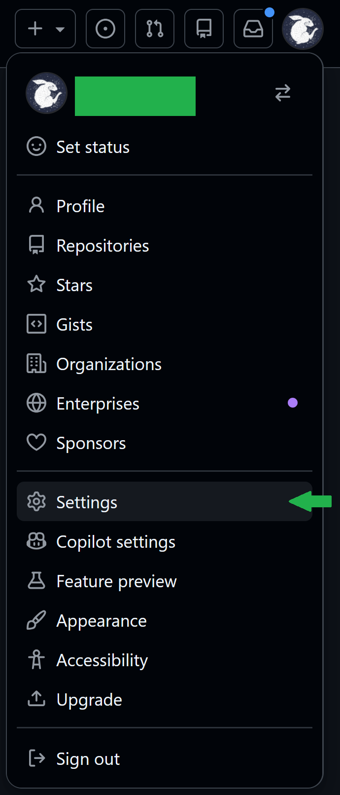
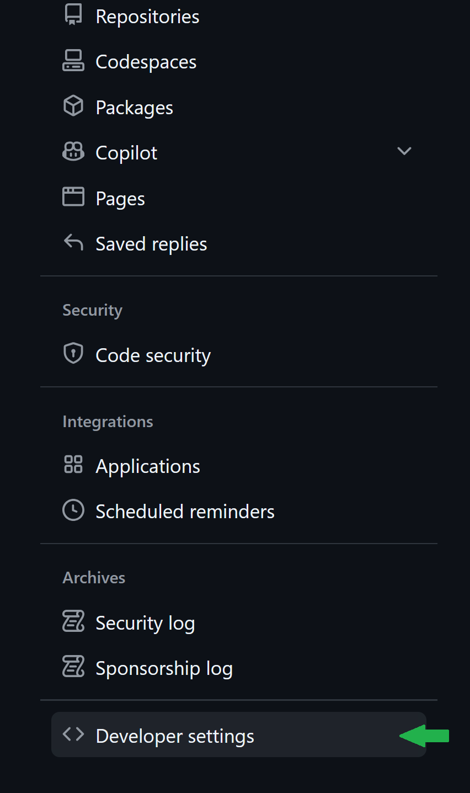
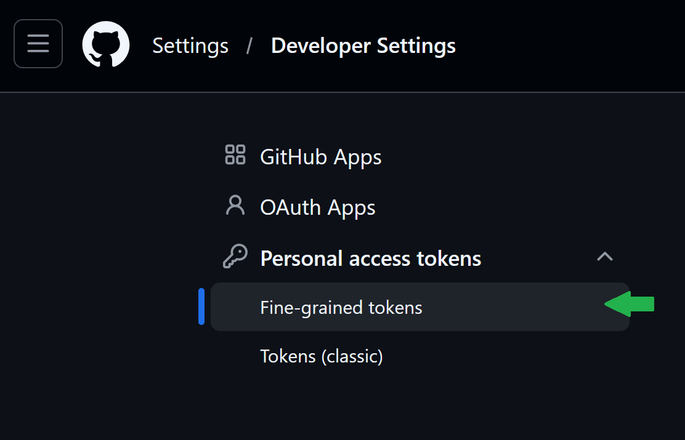
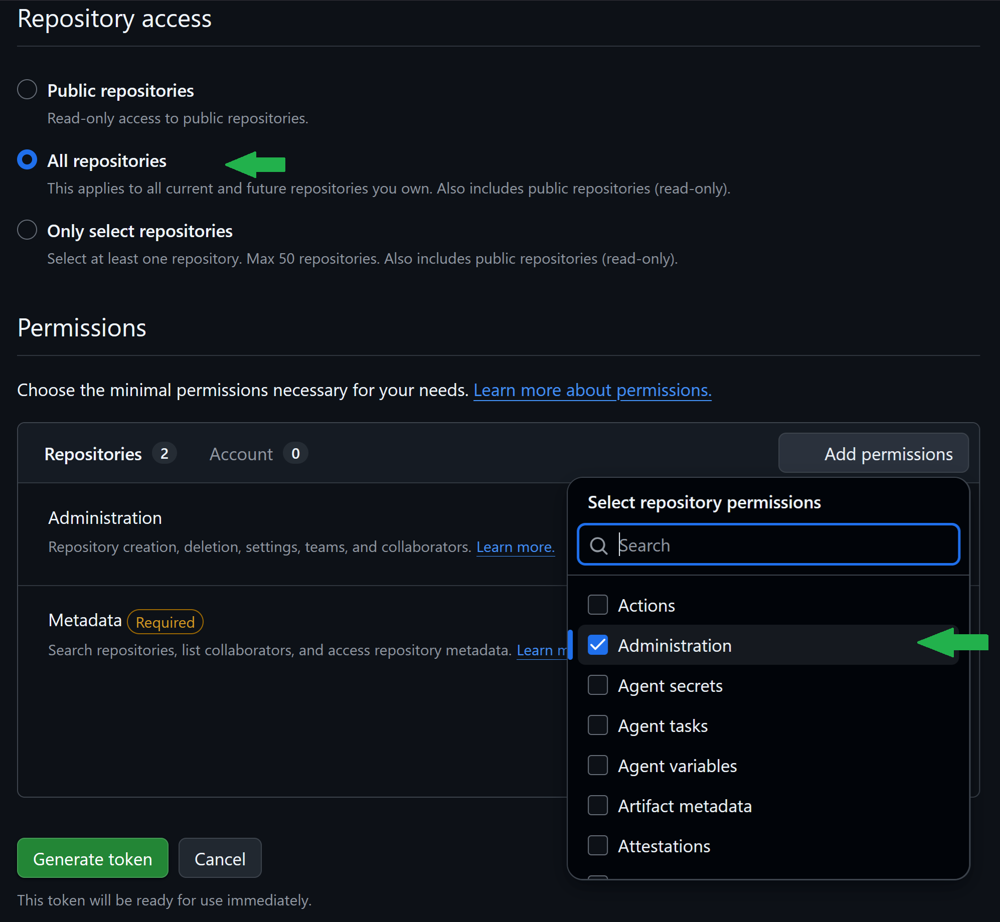
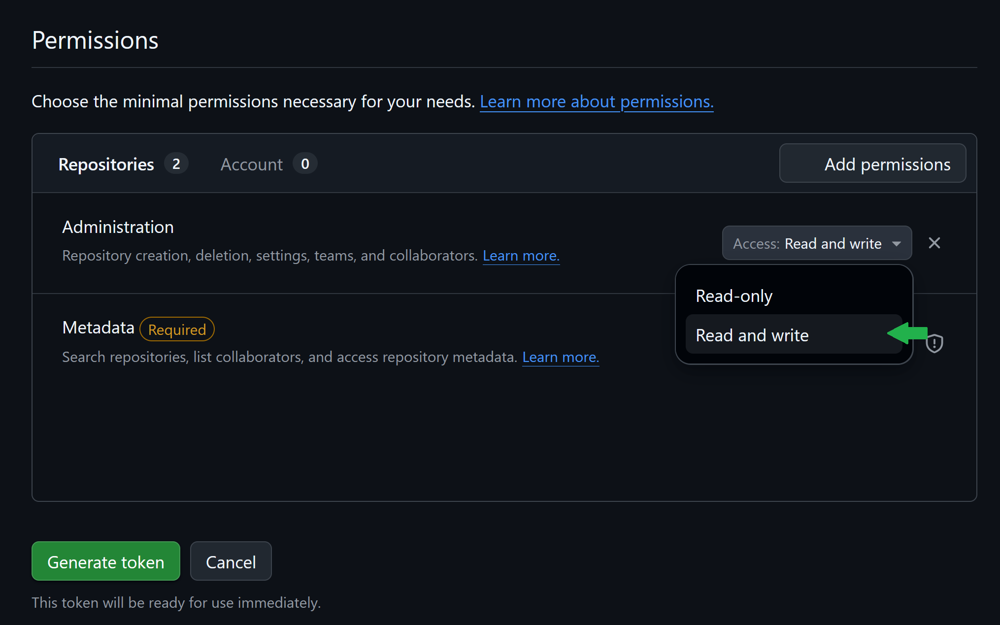
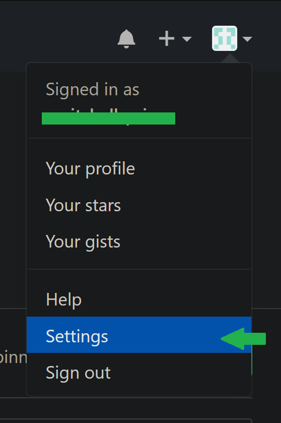
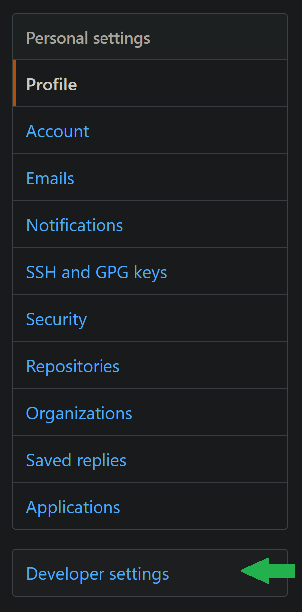
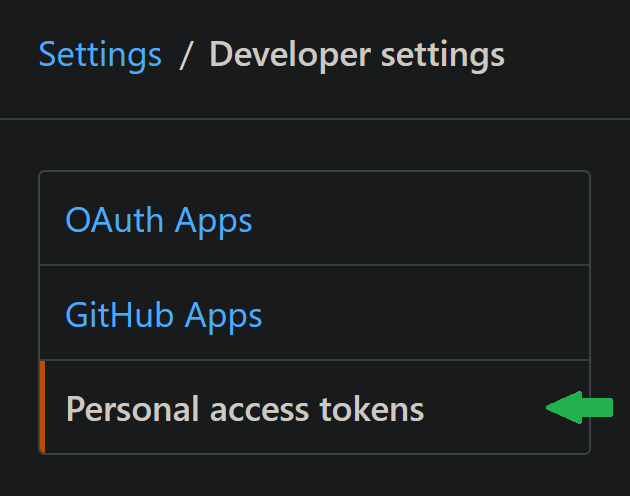
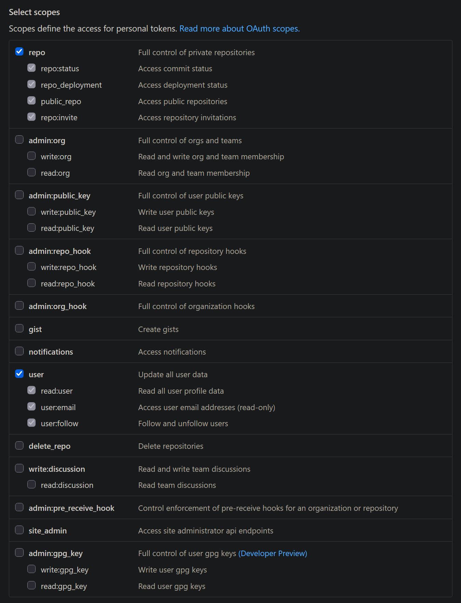

# User Guide for Migrating Repositories for Individual Accounts

This guide is intended for end-users who will be using this project to migrate repositories associated with their user account from one instance of GitHub to another (e.g. from https://github.alaska.edu to https://github.com).

This guide assumes you have Git installed, if you don't, please install it before continuing: https://git-scm.com/install/.

Get started by cloning or downloading this repository to your local machine with one of the following options:
- HTTPS  
`git clone https://github.com/ua-oit-se/github-mover.git`
- SSH (if you already have an SSH key set up on https://github.com)  
`git clone git@github.com:ua-oit-se/github-mover.git`
- GitHub CLI (if you have GitHub CLI set up)  
`gh repo clone ua-oit-se/github-mover`
- Download using the 'Download ZIP' option in the GitHub GUI for this repository

By default every new repo is created as private.

## Prerequisites

After you have created a local clone of this repository on your machine, there are a few items that will need to be in place in order for the script to run successfully:
- PyGithub
- SSH keys (for both the source and the destination)
- Personal Access Tokens (for both the source and destination)

### PyGithub

This code depends on PyGithub, follow the steps to install it:

1. In a console, navigate to the root level of your local clone of this respository  
Generally, use `cd [path]\[to]\[repo]\github-mover` or if the console you used to clone the repository is still open, just `cd github-mover`  
You can use `git status` to check that you're in the correct directory and on the 'master' branch
2. Create a virtual environment (this guide assumes you have python installed, if you don't, please install it before continuing: https://www.python.org/downloads/)  
`python -m venv env`
3. Activate the virtual environment (OS dependent)  
Windows: `.\env\Scripts\activate`  
Linux: `source ./env/bin/activate`
4. Install PyGithub via pip  
You can install it directly: `pip install pygithub`  
Or you can use the requirements document (the only item in it is PyGithub): `pip install -r requirements.txt`

### SSH keys

SSH access to *both* source and destination github sites is necessary.

#### How to create ssh keys (public and private) for GitHub.com and GitHub.alaska.edu access

1. Open Git Bash and run the following command (after replacing '`your_email@example.com`' with your email address or another relevant comment -- you can use the same key pair with both sites)
	- `ssh-keygen -t ed25519 -C "your_email@example.com"`
2. Follow the prompts
	- Enter a name for the file in which to save the key
	- Enter a passphrase or leave it empty for no passphrase
	- Re-enter the passphrase (or lack thereof)
3. Locate the two files generated from that (`[filename]` and `[filename].pub`)
	- If they're not already in your `.ssh` folder, move them there
	- Open `[filename].pub` in Notepad or another text editor
	- Copy the contents of the public key file
4. Log into github.com and github.alaska.edu, then navigate to your profile settings by clicking on your profile image towards the upper right and select 'Settings' from the menu that appears
5. On both sites, in the list on the left-hand side of the page, select 'SSH and GPG keys'
6. On both sites, click the 'New SSH key' button towards the right side of the page
7. On both sites, type a name for your SSH key in the 'Title' field (these don't need to match)
8. On both sites, paste your public key into the 'Key' field (if there is a 'Key type' field, select 'Authentication Key')
9. On both sites, click the 'Add SSH key' button
10. If prompted on either site, confirm your account credentials

##### Update your SSH config file

1. If there isn't a `config` file in your `.ssh` folder, create a new file and name it `config` (no file extension)
2. Open the `config` file in Notepad or another text editor
3. Add the following (replace the bracketed items with your info):
```
Host github.com
  HostName github.com
  KexAlgorithms sntrup761x25519-sha512@openssh.com,curve25519-sha256,curve25519-sha256@libssh.org
  User [username for github.com]
  IdentityFile ~/.ssh/[private key name]

Host github.alaska.edu
  HostName github.alaska.edu
  KexAlgorithms sntrup761x25519-sha512@openssh.com,curve25519-sha256,curve25519-sha256@libssh.org
  User [username for github.alaska.edu]
  IdentityFile ~/.ssh/[private key name]
```

4. Save your changes to the config file

### Personal Access Tokens

In order to get all the repo details you need a [Personal Access Token](https://help.github.com/en/github/authenticating-to-github/creating-a-personal-access-token-for-the-command-line) from each github instance. 
On the destination it must have permission to create a repo.

#### How to create a personal access token in GitHub.com

1. Once logged into github.com, navigate to your profile settings by clicking on your profile image towards the upper right and select 'Settings' from the menu that appears



2. At the bottom of the list on the left-hand side of the page, select 'Developer settings'



3. On the left-hand side of the Developer settings page, select 'Personal access tokens'
4. From the options that appear beneath 'Personal access tokens', select 'Fine-grained tokens'



5. Towards the right-hand side of the screen, select the 'Generate new token' button


6. In the 'Token name' field, give the token a unique name that reflects its purpose (GitHub will let you know if the name is not available)
7. Click on the 'Resource owner' drop-down
8. In the list that appears, select the user account you want to migrate repositories to (your user account is selected by default)
9. (Optional) By default, tokens expire after 30 days, if you would like to change this, click on the 'Expiration' drop-down and select the desired life-span for the token
10. Under the 'Repository access' header, select 'All repositories'
11. In the 'Permissions' section, click the 'Add permissions' button towards the right of the page
12. In the list that appears, select 'Administration'
13. Click the 'Add permissions' button again to close the list



14. Click on the drop-down associated with the 'Administration' permission and select 'Read and write' from the options that appear



15. At the bottom of the page, click 'Generate token'
16. In the dialogue that appears, review your selected permissions
	- If you need to go back and make any changes, click the 'Cancel' button, make your changes, then resume at step 15
	- If everything is ready to go, click on the 'Generate token' button
17. Copy your token (it's a long string of numbers and letters starting with `github_pat_` with a green bell icon to the left of it -- you will not see it again if you navigate away from this page)
18. In your `config.ini` file, paste the token in the 'token' field under the '`[destination]`' header
19. Save your changes to `config.ini`

#### How to create a personal access token in GitHub.alaska.edu

1. Once logged into github.alaska.edu, navigate to your profile settings by clicking on your profile image towards the upper right and select 'Settings' from the menu that appears



2. Near the bottom of the list on the left-hand side of the page, select 'Developer settings'



3. On the left-hand side of the Developer settings page, select 'Personal access tokens'



4. Towards the right-hand side of the screen, select the 'Generate new token' button


5. In the 'Token description' field, give the token a name that reflects its purpose (e.g., my_repo_migration)
6. Select the needed permission scopes
	- `repo` (all items)
	- `admin:org` (all items)



7. Scroll down and click the 'Generate token' button
8. Copy your token (it's a string of numbers and letters with a green check mark to the immediate left of it -- you will not see it again if you navigate away from this page)
9. In your `config.ini` file, paste the token in the 'token' field under the '`[source]`' header
10. Save your changes to `config.ini`

## Usage

To make it simple you can put almost everything in a file named `config.ini` and then only provide the source user and destination user. If you are migrating organizations, the source org and destination org can also be set in this file.
 
config.ini:
```ini
[org_source]
url = github.alaska.edu
token = PersonalAccessTokenOnTheSourceInstanceForORG
[org_destination]
url = api.github.com
token = PersonalAccessTokenOnTheDestinationInstanceForORG
[user_source]
url = github.alaska.edu
token = PersonalAccessTokenOnTheSourceInstanceForUSER
[user_destination]
url = api.github.com
token = PersonalAccessTokenOnTheDestinationInstanceForUSER
```

Then to migrate every repo from OIT-CSS on github.alaska.edu to ua-oit-se on github.com you could use the following command:
```
python migrate.py -s OIT-CSS -d ua-oit-se -o -a
```

And to migrate every repo from a user account on github.alaska.edu to one on github.com you could use the following command:
```
python migrate.py -s [github.alaska.edu username] -d [github.com username] -a
```
This will also automatically update the source repo's README.md with a link to the new repo location, instructions for how to update the git config, and set the source repo to archived to prevent new commits after it's been migrated.


If you don't want to use `config.ini` then everything can be provided via arguments:
```
migrate.py [-h] -s SOURCE -d DESTINATION
                  [--source_url SOURCE_URL] [--dest_url DEST_URL]
                  [--source_token SOURCE_TOKEN]
                  [--destination_token DESTINATION_TOKEN]

optional arguments:
  -h, --help            show this help message and exit
  -s SOURCE, --source SOURCE
                        Source: User or Organization
  -d DESTINATION, --destination DESTINATION
                        Destination: User or Organization
  --source_url SOURCE_URL
                        Source github url
  --dest_url DEST_URL   destination github url
  --source_token SOURCE_TOKEN
                        Source Access Token
  --destination_token DESTINATION_TOKEN
                        Destination Access Token
  -a, --archive         Archive Source Repos with an updated README to the new
                        repo location
  -o, --organization    Organization
                        Organization-specific repositories, default is user-specific repositories
```
